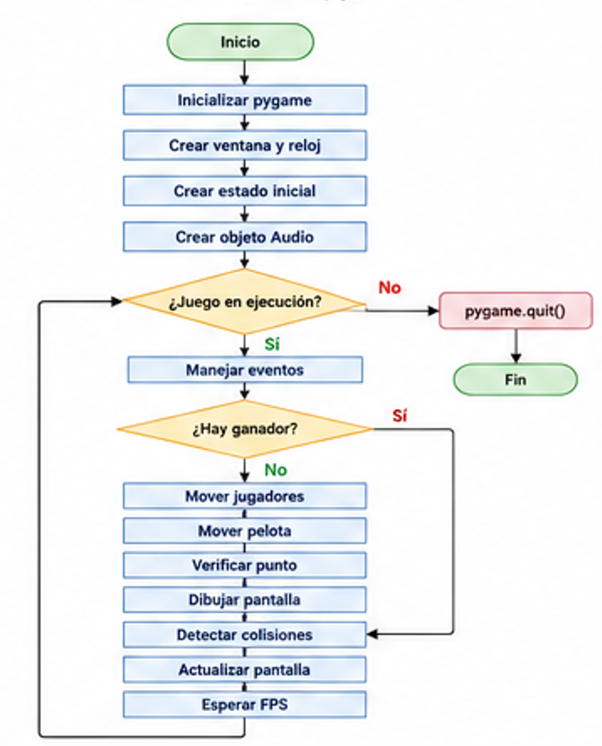
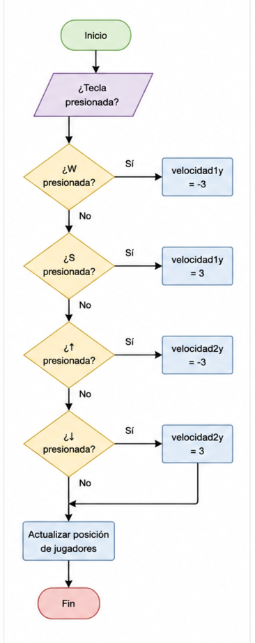
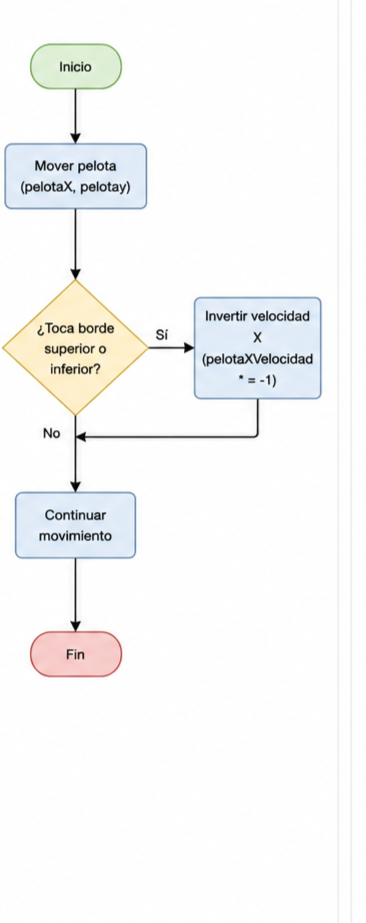
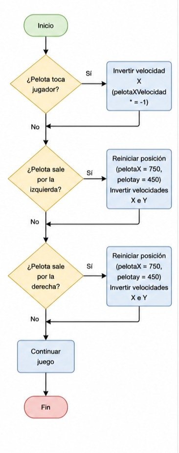
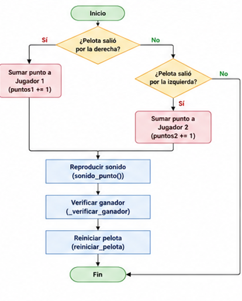

# Atari Pong


## Descripción

Atari Pong es un videojuego clásico de tenis de mesa desarrollado en Python utilizando la biblioteca Pygame. El juego permite que dos jugadores compitan controlando una paleta cada uno, con el objetivo de impedir que la pelota salga de su lado del campo y conseguir puntos al superar al oponente.

El sistema incorpora un marcador en tiempo real que registra la puntuación de ambos jugadores, estableciendo como condición de victoria alcanzar cinco puntos. Una vez que un jugador gana la partida, el juego muestra una pantalla indicando al vencedor y ofrece la posibilidad de reiniciar la partida mediante la tecla ENTER.

Además, el videojuego cuenta con música de fondo que se reproduce continuamente durante la partida y efectos de sonido que mejoran la experiencia del usuario. Se reproducen sonidos cuando la pelota rebota en los bordes del campo, cuando impacta contra las paletas de los jugadores y cuando se anota un punto. Todos los sonidos fueron generados mediante programación utilizando las capacidades de audio de Pygame, sin emplear archivos de audio externos.

El proyecto está organizado de forma modular, separando la lógica del juego, el manejo del estado, el dibujo de los elementos gráficos, el sistema de audio y las constantes de configuración, lo que facilita su mantenimiento, escalabilidad y comprensión.

## Video Explicativo
[Ver video explicativo](https://canva.link/hosk4gi2oycvznn)

## Diagrama de funcionamiento completo


## Diagrama de funcionamiento del comportamiento de los jugadores


## Diagrama de funcionamiento comportamiento de pelota 


## Diagrama de funcionamiento del reinicio de juego

## Diagrama de funcionamiento de puntos

## Características

* Modo de juego para dos jugadores.
* Control de las paletas mediante el teclado (W/S para el Jugador 1 y ↑/↓ para el Jugador 2).
* Movimiento dinámico y continuo de la pelota.
* Detección de colisiones entre la pelota, las paletas y los límites del campo.
* Sistema de puntuación en tiempo real para ambos jugadores.
* Reinicio automático de la pelota después de cada punto anotado.
* Condición de victoria al alcanzar 5 puntos.
* Pantalla de ganador con opción de reiniciar la partida presionando ENTER.
* Música de fondo reproducida durante toda la partida.
* Efectos de sonido para rebotes, golpes de la pelota con las paletas y anotación de puntos.
* Arquitectura modular, separando la lógica del juego, el estado, el dibujo, el audio y las constantes de configuración.
*Desarrollado completamente en Python utilizando la biblioteca Pygame, sin utilizar archivos de audio externos para los efectos sonoros.

## Tecnologías Utilizadas

* Python 3.12
* Pygame 2.6.1


## Controles

### Jugador 1

* W: Mover arriba
* S: Mover abajo

### Jugador 2

* Flecha Arriba: Mover arriba
* Flecha Abajo: Mover abajo

## Instalación
1. Instalar python 3.12
2. Clonar el repositorio.
3. Instalar Pygame.

```bash
py -3.12 -m pip install pygame   

```
4. Ejecutar el archivo principal del proyecto.

## Estado del Proyecto

Versión inicial del juego Atari Pong.
