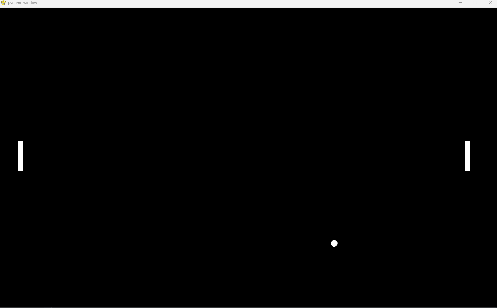

# Atari Pong



## Descripción

Atari Pong es un videojuego clásico de tenis de mesa desarrollado en Python utilizando la biblioteca Pygame. El juego permite que dos jugadores compitan controlando una paleta cada uno, con el objetivo de evitar que la pelota salga de su lado del campo y conseguir puntos al superar al oponente.

#Video Explicativo

#Diagrama de flujo


## Características

* Modo de juego para dos jugadores.
* Movimiento de las paletas mediante el teclado.
* Pelota con movimiento dinámico.
* Detección de colisiones entre la pelota y las paletas.
* Reinicio automático de la pelota después de cada punto.

## Tecnologías Utilizadas

* Python 3.12
* Pygame 2.6.1


## Controles

### Jugador 1

* W: Mover arriba
* S: Mover abajo

### Jugador 2

* Flecha Arriba: Mover arriba
* Flecha Abajo: Mover abajo

## Instalación
1. Instalar python 3.12
2. Clonar el repositorio.
3. Instalar Pygame.

```bash
py -3.12 -m pip install pygame   

```
4. Ejecutar el archivo principal del proyecto.

## Estado del Proyecto

Versión inicial del juego Atari Pong.
